<div align="center">

# 🪨 The Flintstones: Facial Detection & Recognition 🦕

**Classical sliding window detection, powered by two small CNNs.**

Find every face in a frame of *The Flintstones*, then say whether it belongs to
Fred, Wilma, Barney, Betty, or nobody we care about.

[](https://www.python.org/)
[](https://pytorch.org/)
[](https://opencv.org/)
[](#-results)
[](#-results)

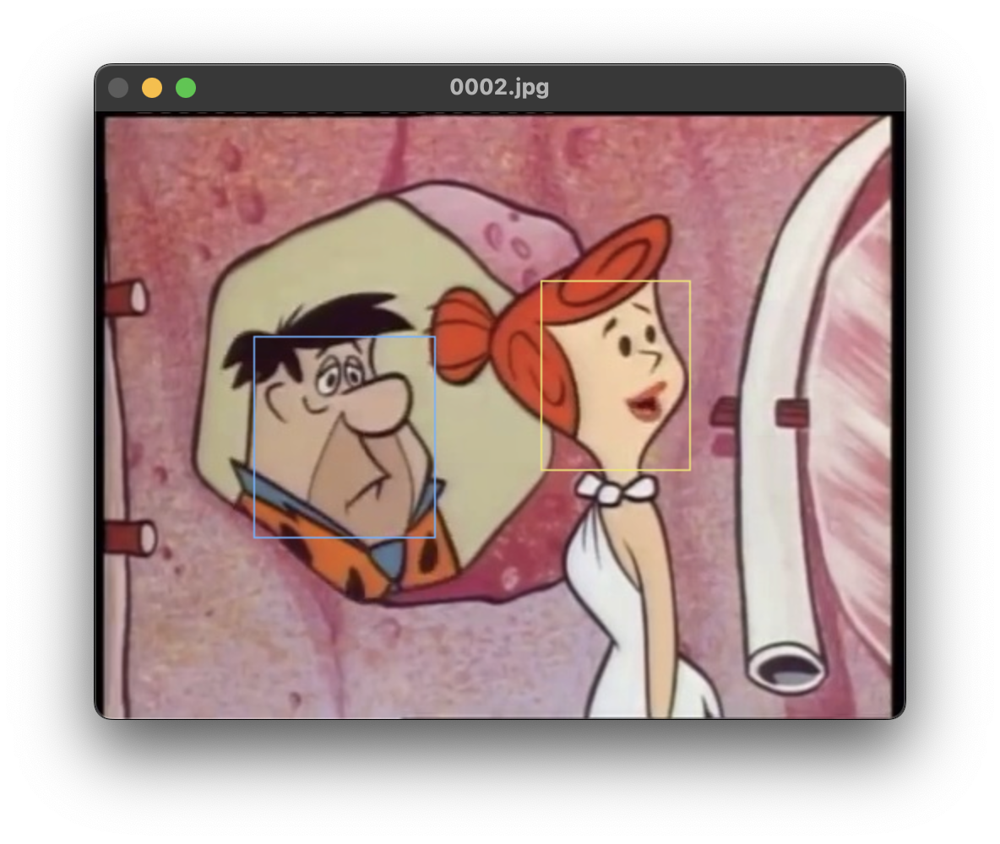 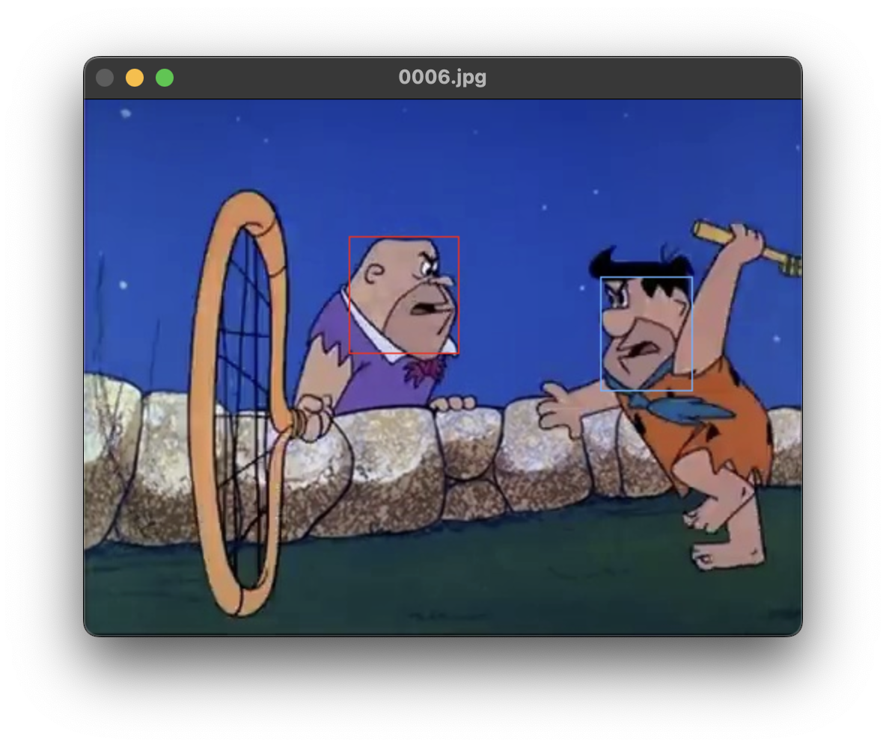
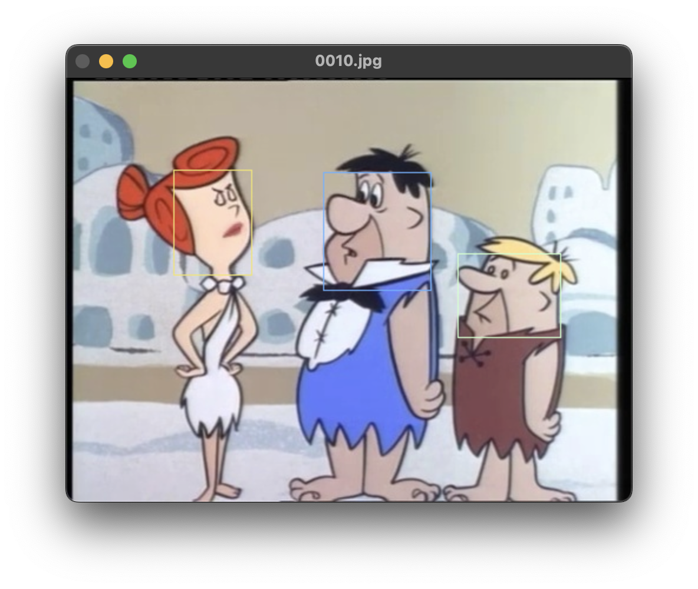 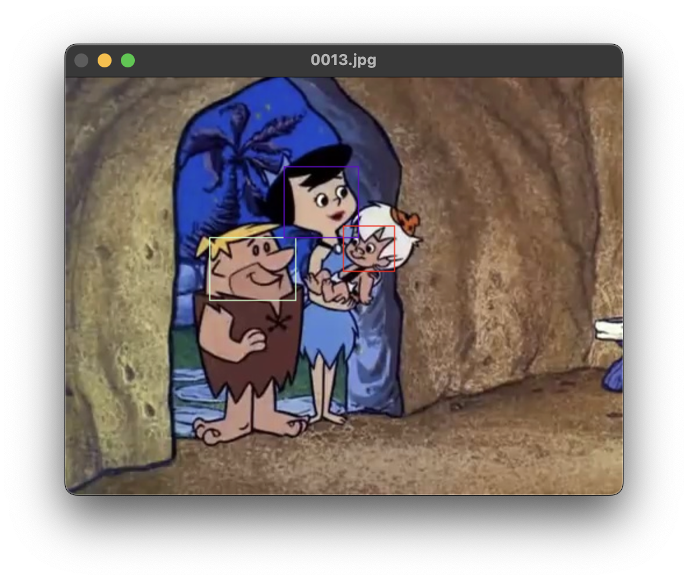

</div>

---

## 📖 Table of Contents

- [About](#-about)
- [Results](#-results)
- [How It Works](#-how-it-works)
  - [1. Patch Extraction](#1-patch-extraction)
  - [2. Classification](#2-classification)
  - [3. Detection](#3-detection)
- [Dataset](#-dataset)
- [Project Structure](#-project-structure)
- [Installation](#-installation)
- [Usage](#-usage)
- [Configuration](#-configuration)
- [Author](#-author)

---

## 🎯 About

This is my solution for **Project 2 of the Computer Vision course (CAVA)**, University of
Bucharest. The full problem statement lives in [`Problem.pdf`](./Problem.pdf), and the
original written report in [`documentation.pdf`](./documentation.pdf).

The project solves two tasks over 480x360 frames extracted from the cartoon:

| Task | Goal | Output |
| :--: | :--- | :--- |
| **Task 1** | **Detection.** Find *all* faces in the frame, whoever they belong to. | Boxes + confidence scores |
| **Task 2** | **Recognition.** Label each detected face as `fred`, `wilma`, `barney`, `betty` or discard it. | Per character boxes + scores |

Instead of reaching for a modern one shot detector, the pipeline stays deliberately
classical: a **multi scale sliding window** scans the frame, a **binary CNN** decides
"face / not a face" for every window, non maximal suppression cleans up the mess, and a
second **5 class CNN** puts a name on whatever survived.

An earlier attempt built on **HOG descriptors + SVM** plateaued at roughly **0.550** average
precision on Task 1, which is what motivated the switch to CNNs.

---

## 📊 Results

Measured with **average precision** (PASCAL VOC style, all point interpolation) on the
200 image test set, counting a detection as correct at an **IoU of 0.3** or above.

| Task | Target | Average Precision |
| :--- | :--- | :---: |
| Task 1 | All faces | **0.908** 🥇 |
| Task 2 | Fred | **0.859** |
| Task 2 | Barney | **0.842** |
| Task 2 | Betty | **0.831** |
| Task 2 | Wilma | **0.779** |
| Task 2 | **Mean (mAP)** | **0.828** |

### Task 1: precision / recall over all faces

<div align="center">
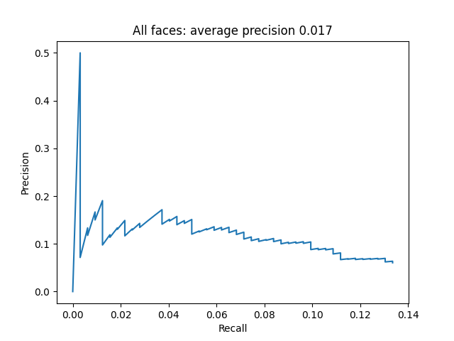
</div>

### Task 2: precision / recall per character

| Fred | Barney |
| :---: | :---: |
| 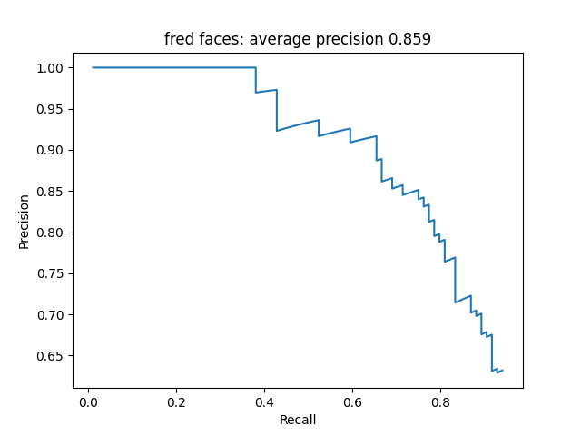 | 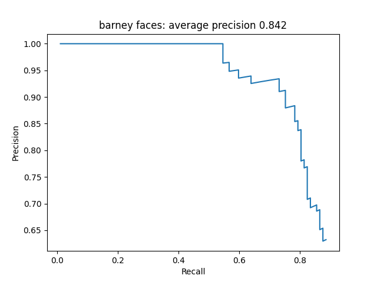 |
| **Betty** | **Wilma** |
| 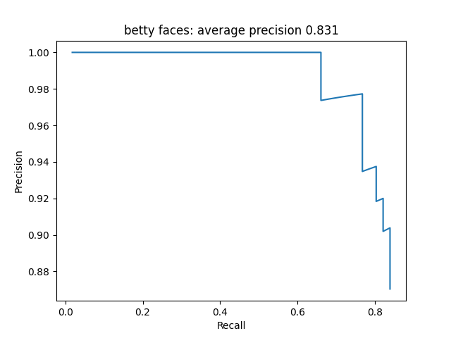 | 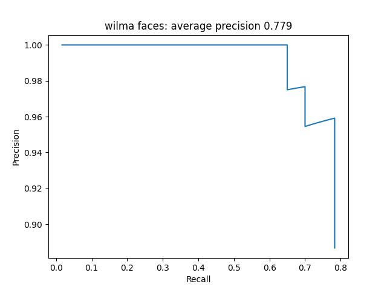 |

> 💡 Task 2 is bounded from above by Task 1: recognition only ever sees the boxes that
> detection produced, so a face missed in Task 1 is permanently lost. This is exactly why
> the per character curves flatten out around 0.8 recall.

---

## 🧠 How It Works

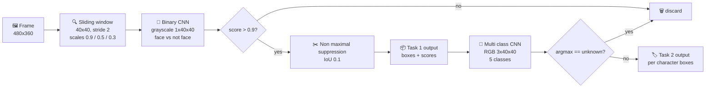

### 1. Patch Extraction

Ground truth faces are almost always **square and around 80x80px**. Rather than sliding an
80px window over full resolution frames, everything is normalised to **40x40px** patches so
the detector can work on downscaled images and stay fast.

<table>
<tr>
<td align="center"><b>✅ Positives</b></td>
<td align="center"><b>❌ Negatives</b></td>
</tr>
<tr>
<td>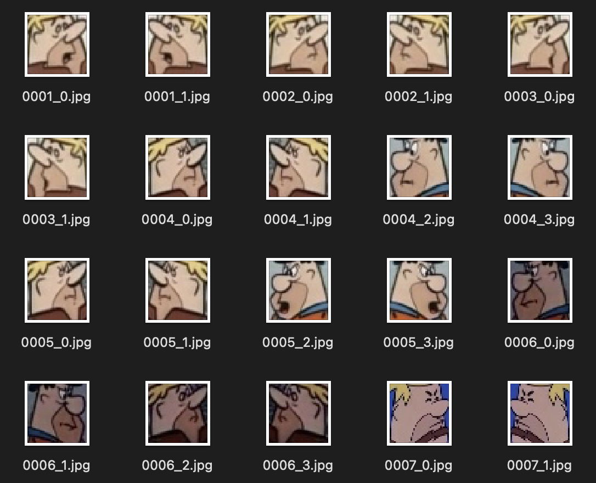</td>
<td>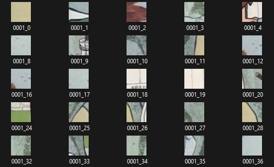</td>
</tr>
<tr>
<td>Every annotated box, resized to 40x40, saved together with its <b>horizontal mirror</b> for free augmentation.</td>
<td><b>50 random 40x40 crops per annotated face</b>, rejected if they intersect any ground truth box at all.</td>
</tr>
</table>

The 50:1 negative to positive ratio is intentional. It produces roughly **350k negative
patches against ~14k positives**, and that imbalance biases the network toward answering
"not a face", which is the right prior when a sliding window feeds it tens of thousands of
background windows per frame.

> I also tried discarding annotations with an area under 400px in the original frame. It
> made no meaningful difference and was dropped.

### 2. Classification

Both networks share the same backbone: **four Conv + ReLU + MaxPool blocks** (16 → 32 → 64 →
64 channels, 3x3 kernels, padding 1), flatten to 256 features, then two dropout guarded
fully connected layers. Only the input channels and the output head differ.

| | 🔲 Task 1: Binary classifier | 🎨 Task 2: Multi class classifier |
| :--- | :--- | :--- |
| **Input** | `1 x 40 x 40` grayscale | `3 x 40 x 40` RGB |
| **Preprocessing** | BGR → grayscale, pixels scaled to `[0, 1]` | BGR → RGB, pixels scaled to `[0, 1]` |
| **Output head** | `Linear(256, 1)` + `Sigmoid` | `Linear(256, 5)` + `Softmax` |
| **Classes** | face / not a face | `barney`, `fred`, `wilma`, `betty`, `unknown` |
| **Loss** | Binary cross entropy | Cross entropy |
| **Optimizer** | Adam, `lr = 1e-4` | Adam, `lr = 1e-4` |
| **Batch size** | 64 | 64 |
| **Epochs** | 10 | 100 |
| **Accuracy** | > 0.99 train and validation | > 0.99 train and validation |
| **Train time (RTX 3070)** | ~30 min | ~5 min |

```python
model = Sequential(
    # Input: 1x40x40 for task1, 3x40x40 for task2
    nn.Conv2d(in_channels=1, out_channels=16, kernel_size=3, padding=1),
    nn.ReLU(),
    nn.MaxPool2d(2, 2),
    nn.Conv2d(in_channels=16, out_channels=32, kernel_size=3, padding=1),
    nn.ReLU(),
    nn.MaxPool2d(2, 2),
    nn.Conv2d(in_channels=32, out_channels=64, kernel_size=3, padding=1),
    nn.ReLU(),
    nn.MaxPool2d(2, 2),
    nn.Conv2d(in_channels=64, out_channels=64, kernel_size=3, padding=1),
    nn.ReLU(),
    nn.MaxPool2d(2, 2),
    nn.Flatten(),
    nn.Dropout(0.25),
    nn.Linear(256, 256),
    nn.ReLU(),
    nn.Dropout(0.25),
    nn.Linear(256, 1),      # 5 for task2
    nn.Sigmoid(),           # nn.Softmax(1) for task2
).to(device)
```

**Why grayscale for detection?** Feeding colour to the binary classifier invites it to latch
onto palette shortcuts (skin tones, Fred's orange shirt) and fire on background props that
happen to share them. Stripping colour pushes the network toward edges and line structure,
which is what actually defines a cartoon face. Task 2 is the opposite case: colour is the
single most discriminative cue between these four characters, so the multi class network
gets full RGB.

**Why overfit on purpose?** A small CNN already reached above 0.99 validation accuracy, yet
produced a flood of false positives once wired into the sliding window. Cartoon characters
look nearly identical from frame to frame, so a deeper network memorising them is not the
failure mode it usually is: it is the goal.

### 3. Detection

| Parameter | Value | Source |
| :--- | :--- | :--- |
| Window size | `40 x 40` | `WINDOW_SIZE` |
| Stride | `2` px | `src/task1.py` |
| Image scales | `0.9`, `0.5`, `0.3` | `SCALES` in `src/task1.py` |
| Score threshold | `0.9` | `THRESHOLD` |
| NMS IoU threshold | `0.1` | `IOU_THRESHOLD` |

The three scales let a fixed 40px window cover faces from roughly 45px up to 130px wide.
Every surviving window is projected back to original image coordinates by dividing by its
scale factor. That is on the order of **36,000 windows per frame**, which is why Task 1 takes
about **2 hours for 200 test images** even on an RTX 3070.

Non maximal suppression is slightly stricter than the textbook version. Beyond the usual
IoU test, a lower scoring box is also suppressed when it is **fully contained** inside a
higher scoring one, or when its **centre falls inside** a higher scoring box. Multi scale
scanning produces exactly those nested duplicates, and plain IoU lets many of them through.

Task 2 then reuses the Task 1 output directly: each detected box is cropped from the colour
frame, resized to 40x40, and pushed through the multi class network. Boxes classified as
`unknown` are dropped, everything else is written to a per character solution file.

---

## 💾 Dataset

Frames are 480x360 stills from the cartoon. Only the test split is committed to the repo,
since the training set is large.

| Split | Images | Annotated faces | In repo |
| :--- | :---: | :---: | :---: |
| Train (`barney`, `betty`, `fred`, `wilma`) | 4,000 | 6,976 | ❌ |
| Validation | 200 | 322 | ❌ |
| Test | 200 | 326 | ✅ |

Test set composition by character:

| Character | Faces | Colour in visualisations |
| :--- | :---: | :--- |
| 🟠 Fred | 81 | light orange |
| 🟢 Barney | 74 | light green |
| 🔵 Wilma | 72 | cyan |
| 🟣 Betty | 59 | magenta |
| 🔴 Unknown | 40 | red |

Annotation format is one detection per line:

```
0001.jpg 106 114 219 235 unknown
0001.jpg 247 91 342 216 wilma
0002.jpg 84 98 205 232 fred
```

Training runs first **collapse** the four per character folders into a single flat
`data/train/collapsed/` directory, remapping filenames as `folder_index * 1000 + image_index`
so nothing collides.

---

## 📁 Project Structure

```
.
├── data/
│   ├── train/                    # 4 character folders + annotations (not committed)
│   ├── validation/               # 200 frames + ground truth (not committed)
│   └── test/                     # 200 frames + ground truth ✅ committed
├── models/
│   ├── best_task1.pth            # binary face detector
│   └── best_task2.pth            # 5 class character classifier
├── src/
│   ├── constants.py              # every path, threshold and hyperparameter
│   ├── pre_training.py           # collapse + patch extraction entry point
│   ├── task1_cnn.ipynb           # trains the binary classifier
│   ├── task2_cnn.ipynb           # trains the multi class classifier
│   ├── task1.py                  # sliding window detection
│   ├── task2.py                  # character recognition over task1 boxes
│   ├── eval.py                   # average precision + PR curves
│   ├── visualize_results.py      # draw ground truth vs detections
│   ├── results/                  # generated PR curve plots
│   └── utils/
│       ├── collapse.py           # merge the 4 train folders into one
│       ├── generate_positives_negatives.py
│       ├── helpers.py            # IoU, NMS, solution writing
│       ├── readers.py            # image and annotation loading
│       └── visualize.py          # OpenCV drawing helpers
├── docs/images/                  # figures used in this README
├── Problem.pdf                   # assignment statement
└── documentation.pdf             # original written report
```

Results are written to `solution/task1/` and `solution/task2/` as `.npy` files:
`detections_*.npy`, `scores_*.npy` and `file_names_*.npy`.

---

## ⚙️ Installation

### Requirements

| Package | Version |
| :--- | :--- |
| python | 3.11.5 |
| numpy | 1.26.3 |
| opencv-python | 4.9.0.80 |
| matplotlib | 3.8.2 |
| scikit-image | 0.22.0 |
| torch | 2.1.2 |
| torchvision | 0.16.2 |
| jupyter | 1.0.0 *(only if you retrain)* |

### 1. Create the environment

Conda is the recommended route. Plain pip works too, as long as you are on Python 3.11.5.

```bash
conda create --name computer-vision-project-2 python=3.11.5
conda activate computer-vision-project-2
pip install numpy==1.26.3 opencv-python==4.9.0.80 matplotlib==3.8.2 scikit-image==0.22.0
```

Then install PyTorch for your platform:

```bash
# CUDA enabled GPU on Windows
pip install torch==2.1.2 torchvision==0.16.2 --index-url https://download.pytorch.org/whl/cu121

# CUDA enabled GPU on Linux, or CPU only on any platform
pip install torch==2.1.2 torchvision==0.16.2

# Only needed if you plan to retrain the networks
pip install jupyter==1.0.0
```

### 2. Set `PYTHONPATH`

Run this from the repository root.

| Shell | Command |
| :--- | :--- |
| Linux / macOS | `export PYTHONPATH=.` |
| Windows PowerShell | `$env:PYTHONPATH='.'` |
| Windows CMD | `set PYTHONPATH=.` |

---

## 🚀 Usage

Pretrained weights ship in `models/`, so you can skip straight to step 2.

### 1. (Optional) Retrain the networks

Generate the collapsed dataset and the positive / negative patches first. This takes
somewhere between 30 seconds and 4 minutes.

```bash
python src/pre_training.py
```

Then run the two notebooks:

```bash
jupyter notebook src/task1_cnn.ipynb   # ~30 min on an RTX 3070
jupyter notebook src/task2_cnn.ipynb   # ~5 min on an RTX 3070
```

> ⚠️ Retraining overwrites the checkpoints in `models/`, so your numbers will drift away
> from the ones reported above.

### 2. Run detection (Task 1)

```bash
python src/task1.py --test     # drop --test to run on the validation split
```

> ⏱️ Roughly **2 hours** for 200 images on an RTX 3070 + i5-14600KF. Without a GPU, expect
> considerably longer. This is the price of an exhaustive sliding window.

### 3. Run recognition (Task 2)

Task 2 consumes the boxes produced by Task 1, so **run Task 1 first**. On its own it takes
seconds.

```bash
python src/task2.py --test     # drop --test to run on the validation split
```

### 4. Evaluate

Prints average precision and writes the PR curves into `src/results/`. It points at the
test split by default; edit `ground_truth_path_root` in `src/eval.py` to evaluate the
validation split.

```bash
python src/eval.py
```

### 5. Visualise

Opens each validation frame with ground truth boxes (colour coded per character) and
predicted boxes in green, annotated with their confidence score.

```bash
python src/visualize_results.py
```

---

## 🎛️ Configuration

Everything worth tuning sits in [`src/constants.py`](./src/constants.py), except the
scan scales which live in `src/task1.py`.

| Constant | Default | Effect |
| :--- | :---: | :--- |
| `WINDOW_SIZE` | `40` | Sliding window and patch side length |
| `THRESHOLD` | `0.9` | Minimum sigmoid score to keep a window. Lower it for more recall and more false positives |
| `IOU_THRESHOLD` | `0.1` | NMS aggressiveness. Higher values keep more overlapping boxes |
| `IMAGE_WIDTH` / `IMAGE_HEIGHT` | `480` / `360` | Frame dimensions |
| `LABELS_MAP` | 5 entries | Character to class index mapping |
| `COLOR_CHARACTER_MAPPING` | 5 entries | BGR colours used when drawing boxes |
| `SCALES` *(in `task1.py`)* | `[0.9, 0.5, 0.3]` | Image pyramid. Add scales for better coverage at a linear cost in runtime |

---

## 👤 Author

**Hutan Mihai Alexandru**

[](https://github.com/hutanmihai)
[](https://www.linkedin.com/in/hutanmihai/)
[](https://mihaihutan.ro)

<div align="center">

**Yabba dabba doo!** 🦴

</div>
